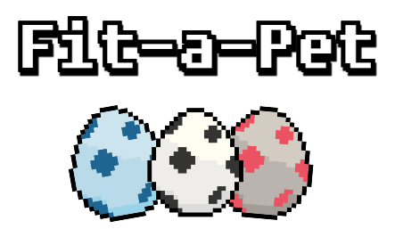
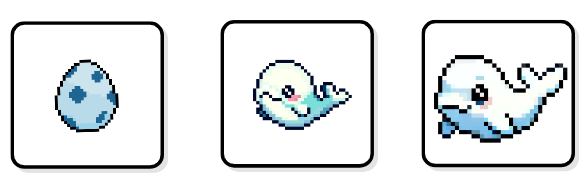
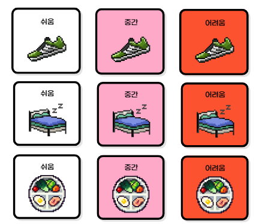
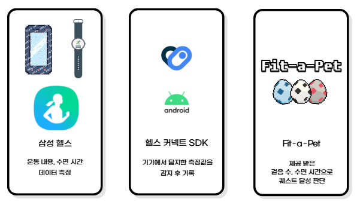
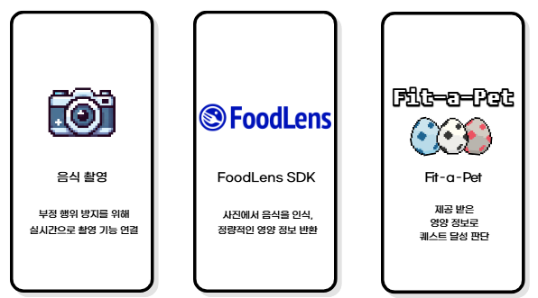

# 🐾 Fit-A-Pet

## 📌 개요
> **일상 데이터를 통해 자신만의 펫을 성장시키고 펫 도감을 채워가는 건강관리 솔루션**

## 📱 주요 기능

### 🐶 펫

- 퀘스트를 통해 얻은 경험치로 레벨 업
- 특정 레벨을 달성하면 성장한 형태가 해금되고 도감에 등록
- 총 2번에 걸쳐 성장하며 최종 형태 달성 시 새로운 알 획득

### ✅ 퀘스트

- 운동량, 영양 섭취량, 수면 시간 등 일상 생활에서 수집한 데이터를 통해 달성 가능
- 퀘스트 달성 시 난이도 별로 경험치 차등 획득

- 삼성 헬스와 헬스 커넥트를 통해 운동량과 수면 시간 데이터 측정

- FoodLens를 통해 음식 사진을 찍으면 섭취한 영양 정보 측정

### 🛡 길드

- 초대 코드로만 가입 가능한 프라이빗한 소모임
- 유효기간과 길드 정보를 조합해 NanoID로 초대 코드 생성
- 길드장이 길드 퀘스트를 설정해 공통의 목표를 달성하며 함께 즐김

## 🛠 기술 스택

| 구분       | 기술 |
|------------|------|
| Backend    | Java, Spring Boot |
| Frontend   | React Native |
| Database   | MySQL |
| Cache      | Redis |

## 🗓️ 개발 기간
> **2024.10.14 ~ 2024.11.29**

## 👨‍👩‍👧‍👦 팀원 소개

### 🔧 Backend
- 남동균  
- 유경헌  
- 정문기  

### 🎨 Frontend
- 백소연  
- 이소라  
- 장성일  
